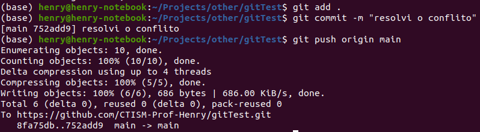

# gitEssentials

Este repositório organiza o conhecimento sobre o uso de git e Github.

## Sumário

* [Introdução](#introdução)
* [Comandos do git](#comandos-do-git)
* [Resolvendo conflitos](#resolvendo-conflitos)

## Introdução

Em breve.

## Comandos do git

Em breve.

## Resolvendo conflitos

Quando você estiver trabalhando colaborativamente em um repositório do Github 
(ou seja, com mais de duas pessoas), pode ser que no fluxo de trabalho, um colega
seu envie arquivos para o Github que você não possui na sua máquina local. Você
descobrirá que isso aconteceu quando tentar enviar os arquivos para o Github 
com um `git push`:


Esta janela está basicamente dizendo que você não pode enviar seu código para
o Github porque existem modificações nos arquivos que você não baixou ainda.
Você precisa então baixá-las, usando um `git pull`.

Às vezes, o git (o programa que você usa na linha de comando para mandar o 
código-fonte para o Github) consegue conciliar ambas as modificações, da sua máquina
local, e do repositório do Github. Porém, quando ele não consegue fazer isso,
você mesmo terá que **resolver o conflito** que ocorreu nos arquivos. 

Você saberá que é essa a hora quando um `git pull` resultar numa mensagem parecida
com essa:


Nesta imagem, o git não sabe como você quer conciliar os conflitos, e está perguntando
à você o que deve fazer (no texto escrito em amarelo). Neste curso, vamos usar
a opção **merge**, rodando o seguinte comando: 

```bash
git config pull.rebase false
```

Rode novamente o comando `git pull origin main`:


A mensagem _Automatic merge failed; fix conflicts and then commit the result_
quer dizer que você terá que abrir os arquivos que resultaram em conflitos e
deixá-los da maneira que eles devem ficar corretamente. Você saberá quais arquivos
estão dando conflito pela mensagem do git; na imagem acima, o conflito está
no arquivo README.md.

Abrindo o arquivo README.md pelo Sublime Text, vemos que ele está da seguinte 
maneira:


O arquivo está organizado da seguinte maneira: os caracteres `<<<<` marcam
o começo da região que resultou em um conflito; os caracteres `>>>>` marcam
o fim da região conflitante. Os caracteres `====` marcam a divisão do código;
onde diz `HEAD`, é o código da sua máquina local, e o código (neste exemplo)
marcado pela hash `8fa75db4cccadfec3d45a5e8a8ee10c9c6fb1697` é o código que veio
do repositório do Github (na verdade, esta hash é o ID do commit no Github).

Arrume o arquivo de maneira que ele concilie as modificações que você fez, e
as que seu colega fez (e já estão no Github):


Após a correção, volte para a linha de comando e envie as modificações para o
Github:



Pronto! Com isso, tanto seu código, quando o do seu colega, estarão no Github:


Você pode ver o repositório em que realizei este tutorial por 
[este link](https://github.com/CTISM-Prof-Henry/gitTest).