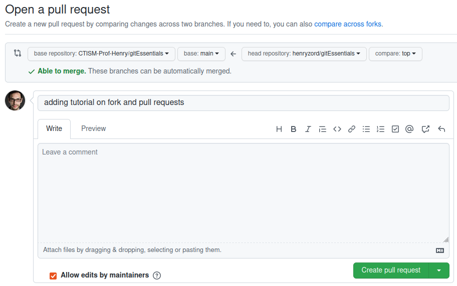

## Fazendo fork e pull requests

### Sumário

* [Introdução](#introdução)
* [Passo-a-passo](#passo-a-passo)

### Introdução

Essa página é um **esboço.** Ela será aprimorada depois.

### Passo-a-passo

1. Entrar na página do repositório que deseja-se fazer o fork, no github. Vamos 
   chamá-lo de `https://github.com/CTISM-Prof-Henry/gitEssentials`
2. Clicar no botão "fork", no canto superior direito: 
3. Confirmar que deseja-se fazer fork na tela que aparecer:


4. Clonar o repositório que foi recém criado (a cópia, não o original) com 
   `git clone`. Por exemplo, se eu, henryzord, fizer um fork do repositório 
   **gitEssentials** (que pertence à conta CTISM-Prof-Henry), a URL do meu 
   repositório copiado será `https://github.com/henryzord/gitEssentials`, e o 
   comando a ser dado é

```bash
git clone https://github.com/henryzord/gitEssentials
```

5. Criar uma nova **branch local**, e mudar para ela: 
   `git checkout -b <nome da branch>`. Supondo que eu queira criar uma nova branch
    de nome **top**, o comando a ser dado é

```bash
git checkout -b top
```

6. Notificar o git de que este repositório relaciona-se com o repositório original:
`git remote add upstream <url do repo original>`. No exemplo, ficaria

```bash
git remote add upstream https://github.com/CTISM-Prof-Henry/gitEssentials
```

7. Fazer as modificações necessárias no código-fonte (editar, deletar ou criar 
   arquivos)
8. Adicionar arquivos com `git add`: `git add .`, por exemplo
9. Salvar modificações com `git commit -m "mensagem"`
10. Dar um `git pull` para atualizar o repositório local com as modificações do 
    repositório remoto original
11. Enviar modificações para o repositório copiado, em uma **branch remota** 
    que será criada, chamada **top**: `git push -u origin top`
12. Depois que você enviar as modificações para o seu repositório copiado, você 
    pode acessá-lo pelo Github. Você perceberá uma mensagem na tela inicial, 
    mostrando o quão atualizado seu código deste repositório está em relação
    ao código do repositório original:


13. Nós iremos enviar as modificações que fizemos no repositório copiado para o 
    repositório original. **Atenção:** faça isso apenas quando você tiver terminado
    de fazer **todas** as modificações necessárias no seu repositório copiado.

    No seu repositório copiado, como mostrado na figura acima, clique no botão 
    **Pull requests**

14. Clique no botão **new pull request**: 
15. Abrirá uma tela que irá comparar o seu código-fonte copiado com o código-fonte
    original. Como a visualização padrão do Github é para a branch **main**, não
    irá mostrar nada significante, pois criamos uma nova branch **top**:


16. No seletor do repositório copiado, mude para a branch **top**:


17. Clique no botão **create new pull request**: 
18. Neste passo você pode escrever uma mensagem para o administrador do repositório
    original, explicando as modificações que foram feitas no pull request. Depois
    de escrever sua mensagem para ele, clique em **create pull request**.



19. Esta tela é o que o **administrador do repositório original** verá, 
    no Github dele:


Se ele aceitar suas modificações, elas serão integradas ao repositório original.
Você poderá vê-las na lista de commits do repositório original.

