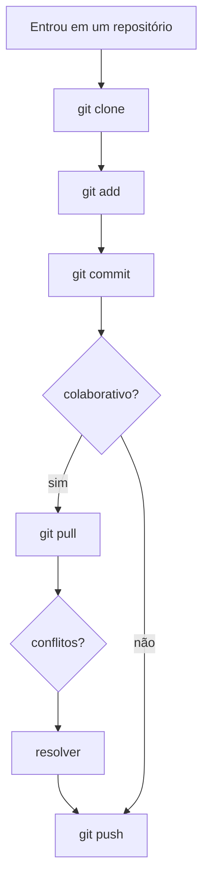

## Quick start

O fluxo de trabalho mais comum quando trabalhamos com git é o seguinte:

**Nota:** Para resolver conflitos, confira [este tutorial](resolvendo_conflitos.md)

```mermaid
graph TD; 

A[Entrou em um repositório]

D[git clone]
E[git add]
F[git commit]
G[git pull]
H[git push]
I{colaborativo?}
B{conflitos?}
C[resolver]

A --> D --> E --> F --> I -- sim --> G --> B --> C --> H
I -- não --> H
```