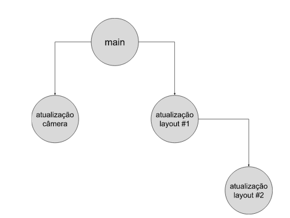

# Conceitos

## Sumário

* [Repositório](#repositório)
* [Branch](#branch)
* [Commit](#commit)
* [Qual a diferença entre repositório remoto e local?](#qual-a-diferença-entre-repositório-remoto-e-local)
* [Boas práticas no uso do git](#boas-práticas-no-uso-do-git)

## Repositório

Também conhecido como repo ou repository, um repositório é um local para 
armazenar código-fonte, ou informações textuais, sobre o desenvolvimento de uma 
aplicação, algoritmo, ou software.

Não se deve guardar arquivos binários (e.g. .exe) em um repositório de código-fonte, 
pois não é este o objetivo dessas ferramentas. Arquivos binários são melhor 
armazenados em drives online (e.g. Google Drive, One Drive, Dropbox, etc).

Para verificar se um arquivo é binário, tente abri-lo pelo bloco de notas: se o 
texto não for legível, então o arquivo é binário.

## Branch

Uma branch é um recurso do git para manter um código-fonte paralelo ao código-fonte
principal. No Github, a branch principal é chamada de **main**; este é o mesmo
main que escrevemos quando damos os comandos `git push origin main` e 
`git pull origin main`. 

Contudo, se tivéssemos outra branch em um dado repositório, vamos supor que de nome
**teste**, e quiséssemos baixar ou enviar código para esta branch, faríamos 
`git pull origin teste` e `git push origin teste`.

A ideia de usar branches é isolar códigos-fonte que estão sendo desenvolvidos por
equipes (ou pessoas) diferentes. Por exemplo, se levássemos em consideração
a equipe que desenvolve o aplicativo Instagram, existem diversas equipes de 
desenvolvedores trabalhando ao mesmo tempo neste aplicativo. Uma equipe poderia
ser responsável por atualizar o software da câmera, enquanto outra muda uma parte
do layout do app. Portanto, usar branches neste cenário é vantajoso, pois as 
modificações feitas pela equipe do layout não irão interferir no código das outras
equipes.

Por costume, mantemos sempre na branch main o código-fonte de **produção** (ou
seja, o código-fonte que está pronto para ser entregue ao cliente). Como neste 
curso não temos clientes para os quais vender um produto, não tem problema usar
a branch main para desenvolver todo o código-fonte de um trabalho. Mas tenha em
mente que em uma empresa, esta é a filosofia adotada.

Você pode criar quantas branches quiser, com os nomes que quiser. Inclusive, 
você pode ter branches que são branches de outras branches, como mostrado na 
figura abaixo.



## Commit

Um commit é um _checkpoint_, uma versão do código-fonte em uma determinada branch. 
Ele possui um identificador único, um código gigante, chamado de hash. 

Commits são salvos no repositório (tanto local quanto remoto) para sempre, a menos
que sejam explicitamente deletados por alguém. Com isso, os arquivos daquele commit
estão salvos, mesmo que posteriormente sejam modificados ou deletados. Esta é 
uma das maiores vantagens de utilizar-se o git, pois podemos ver o histórico de
um arquivo, podendo inclusive ver quem escreveu cada linha de cada arquivo.

Você pode ver a lista de commits de uma determinada branch clicando no botão
de commits, na página inicial de um repositório:


Você pode ver os commits da branch main deste repositório 
[neste link](https://github.com/CTISM-Prof-Henry/gitEssentials/commits/main). Para
cada um dos commits neste link, existem três botões:


O primeiro botão copia a hash do commit; o segundo botão mostrará uma lista das
modificações que foram feitas naquele commit. O terceiro link mostra a estrutura
do repositório como estava na época deste commit.


## Qual a diferença entre repositório remoto e local?

Primeiro, vamos por partes: um **repositório** é uma **pasta** que por sua vez
possui outra pasta dentro de si, oculta, chamada `.git`. Dentro da pasta oculta 
`.git`, existem diversos meta-arquivos que fazem o controle dos arquivos do 
**repositório.**

Um repositório é um repositório independentemente de onde ele esteja: seja na
máquina local (e daí vem o termo **repositório local**), ou seja em algum site (daí
vem o termo **repositório remoto**). Sites que armazenam repositórios são, por
exemplo, o [Github](https://github.com), [GitKraken](https://www.gitkraken.com), 
[BitBucket](https://bitbucket.org), [Gitlab](https://about.gitlab.com), 
dentre outros.

É possível trabalhar com git sem nunca criar uma conta num repositório remoto, 
porém isso é perigoso, pois caso a máquina local sofra alguma falha (seja formatada,
falte energia elétrica, etc), podemos perder os dados.

## Boas práticas no uso do git

Não é preciso seguir estritamente essa sequência de comandos, mas é altamente 
recomendado.

1. Dê um `git status` para ver se existem modificações não salvas no seu 
   **repositório local**
2. Se houverem modificações (arquivos escritos em vermelho), salve-as em um commit:

```bash
git add <param>
git commit -m "mensagem do commit dizendo o que foi feito"
```

Onde `<param>` é um parâmetro válido do `git add` (veja a entrada do comando
add na página [Comandos](comandos.md#git-add)).

Ou, alternativamente, descarte-as:

```bash
git restore <param>
```

Onde `<param>` é um parâmetro válido do `git restore` (veja a entrada do comando
restore na página [Comandos](comandos.md#git-restore)).

3. Dê um `git pull origin <nome da branch remota>` para baixar modificações que
   estão no repositório remoto 
4. Dê um `git push origin <nome da branch remota>` para enviar as modificações
   ao repositório remoto.

**Nota:** pode ser que **aconteça um conflito** no passo 3. Neste caso,
[consulte esta página](resolvendo_conflitos.md) para saber como resolver.

