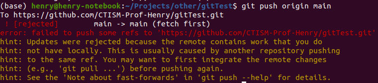
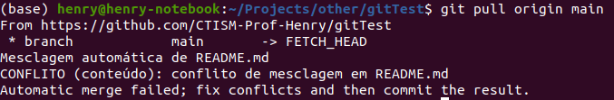

.. _resolvendo-conflitos:

Resolvendo conflitos
--------------------

**Nota:** Você pode ver o repositório no qual eu realizei este tutorial
por `este link <https://github.com/CTISM-Prof-Henry/gitTest>`__.

Quando você estiver trabalhando colaborativamente em um repositório do
Github (ou seja, com mais de duas pessoas), pode ser que no fluxo de
trabalho, um colega envie arquivos para o Github que você não possui na
sua máquina local. Você descobrirá que isso aconteceu quando tentar
enviar os arquivos para o Github com um ``git push``:

|image0|

Esta janela está basicamente dizendo que você não pode enviar seu código
para o Github porque existem modificações nos arquivos que você não
baixou ainda. Você precisa então baixá-las, usando um ``git pull``.

Às vezes, o git (o programa que você usa na linha de comando para mandar
o código-fonte para o Github) consegue conciliar ambas as modificações:
as da sua máquina local, e do repositório do Github. Porém, quando ele
não consegue fazer isso, você mesmo terá que **resolver o conflito** que
ocorreu nos arquivos.

Você saberá que é essa a hora quando um ``git pull`` resultar numa
mensagem parecida com essa:

|image1|

Ou então essa:

|image2|

Dependendo de qual tela apareceu para você, clique no link abaixo para
ir para a etapa do tutorial correspondente.

-  :ref:`Primeira tela <resolvendo-conflitos-tela-1.md>`
-  :ref:`Segunda tela <resolvendo-conflitos-tela-2>`
-  :ref:`Nenhuma das duas <resolvendo-conflitos-tela-3>`

.. |image1| image:: ../imagens/conflito_2.png

