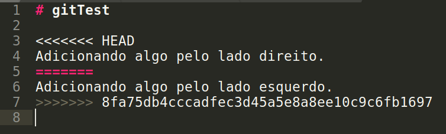
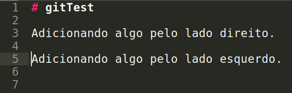
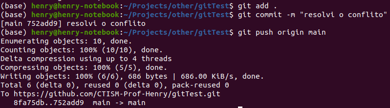

.. _resolvendo-conflitos-tela-2:

Finalizando
===========

|image0|

A mensagem *Automatic merge failed; fix conflicts and then commit the
result* quer dizer que você terá que abrir os arquivos que resultaram em
conflitos e deixá-los da maneira que eles devem ficar corretamente. Você
saberá quais arquivos estão dando conflito pela mensagem do git; na
imagem acima, o conflito está no arquivo README.md.

Abrindo o arquivo README.md pelo Sublime Text, vemos que ele está da
seguinte maneira:

|image1|

O arquivo está organizado da seguinte maneira: os caracteres ``<<<<``
marcam o começo da região que resultou em um conflito; os caracteres
``>>>>`` marcam o fim da região conflitante. Os caracteres ``====``
marcam a divisão do código; onde diz ``HEAD``, é o código da sua máquina
local, e o código (neste exemplo) marcado pela hash
``8fa75db4cccadfec3d45a5e8a8ee10c9c6fb1697`` é o código que veio do
repositório do Github (na verdade, esta hash é o ID do commit no
Github).

Arrume o arquivo de maneira que ele concilie as modificações que você
fez, e as que seu colega fez (e já estão no Github):

|image2|

Após a correção, volte para a linha de comando e envie as modificações
para o Github:

|image3|

Pronto! Com isso, tanto seu código, quando o do seu colega, estarão no
Github:

|image4|

.. |image0| image:: ../../imagens/conflito_3.png

.. |image4| image:: ../../imagens/conflito_7.png
