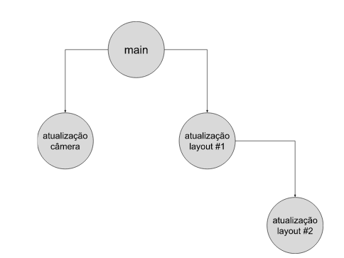

.. _conceitos:

Conceitos
=========

Agora que trabalhamos com diversos conceitos do git, é interessante colocá-los em perspectiva, bem como fornecer uma
explicação mais detalhada sobre o que cada um deles representa.

Repositório
-----------

Também conhecido como *repo* ou *repository*, um repositório é um local para armazenar código-fonte (ou, alternativamente,
arquivos não-binários). É possível por exemplo armazenar aquivos de texto como ``txt`` (não-binário), mas não é possível
armazenar arquivos ``docx`` (binário). A maioria dos arquivos que dizem respeito ao desenvolvimento de um software,
algoritmo ou programa são não-binários, e foi com este propósito que os repositórios foram propostos.

Não é recomendável armazenar arquivos binários (e.g. ``programa.exe``) em um repositório, pois não poderemos efetivamente
manter um controle de versão sobre estes arquivos. Para estes arquivos, é recomendável armazená-los em outros serviços,
como Google Drive, One Drive, Dropbox, dentre outros.

Para verificar se um arquivo é binário, tente abri-lo usando um editor de textos, como o bloco de notas: se o texto for
não-legível, então o arquivo é binário.

Branch
------

Um repositório pode conter diversos *branches*, ou "galhos", na tradução em português (apesar que mesmo programadores
brasileiros se referem à estes galhos como *branches*). Branches são uma maneira de manter códigos-fonte similares,
porém paralelos, ao mesmo tempo, em um mesmo repositório. Imagine por exemplo uma empresa que desenvolve um aplicativo
de tirar fotos e postá-las em uma rede social. Existem diversas equipes de desenvolvedores trabalhando ao
mesmo tempo no aplicativo: uma equipe poderia ser responsável por atualizar o software da câmera; enquanto outra muda
uma parte do layout. Portanto, usar branches neste cenário é vantajoso, pois as modificações feitas pela equipe do layout
não interferirão no código-fonte das outras equipes.

Quando criamos um repositório (seja localmente ou remotamente), é obrigatório criar uma branch principal, onde o
código-fonte **de produção** será mantido. A ideia é que nesta branch uma versão pronta do nosso software esteja armazenada,
sem bugs e sem tarefas por fazer. Como neste material não temos clientes para os quais vender um software, não tem
problema usar a branch main para desenvolver todo o código-fonte de um trabalho. Mas tenha em mente que em uma empresa,
esta é a filosofia adotada.

Quando criamos um repositório pelo GitHub, o site cria automaticamente uma branch principal para nós, de nome **main**.
É este o mesmo nome que usamos quando usamos os comandos ``git push origin main`` e ``git pull origin main``. Se por
outro lado tivermos uma segunda branch em um repositório, de nome **teste**, os comandos seriam ``git pull origin teste``
e ``git push origin teste``.

Você pode criar quantas branches quiser, com os nomes que quiser. Inclusive, você pode ter branches que são branches de
outras branches, como mostrado na figura abaixo.

.. only:: html

   |image0_html|

.. only:: latex

   |image0_latex|

Commit
------

Um commit é um *checkpoint*, uma versão do código-fonte em uma determinada branch. Ele possui um identificador único,
um código de letras e números, chamado de *hash*. A *hash* é única à um commit; nenhum outro commit possuirá a mesma
*hash*.

Commits são salvos no repositório (tanto local quanto remoto) para sempre, a menos que sejam explicitamente deletados.
Com isso, os arquivos daquele commit estão salvos, mesmo que posteriormente sejam modificados ou deletados. Esta é uma
das vantagens de utilizar-se o git, pois podemos ver o histórico de um arquivo, vendo inclusive quem escreveu cada linha
de cada arquivo.

Podemos ver a lista de commits de uma determinada branch clicando no botão de commits, na página inicial de um repositório:

|image1|

Os commits da branch main do repositório que gera este material estão neste link [#]_. Para cada um dos commits
deste repositório, existem três botões:

|image2|

O primeiro botão copia a hash do commit. O segundo botão mostrará uma lista das modificações que foram feitas naquele
commit. Finalmente, o terceiro link mostra a estrutura do repositório como estava à época deste commit.

Qual a diferença entre repositório remoto e local?
--------------------------------------------------

Um **repositório** é uma **pasta** que por sua vez possui outra pasta dentro de si, oculta, chamada ``.git``.
Dentro da pasta oculta ``.git``, existem diversos meta-arquivos que fazem o controle dos arquivos do **repositório.**

Um repositório é um repositório independentemente de onde ele esteja: seja na máquina local (e daí vem o termo
**repositório local**), seja em algum site (daí vem o termo **repositório remoto**). Sites que armazenam repositórios
são, por exemplo, o `Github <https://github.com>`__, `GitKraken <https://www.gitkraken.com>`__,
`BitBucket <https://bitbucket.org>`__, `Gitlab <https://about.gitlab.com>`__, dentre outros.

É possível trabalhar com git sem nunca criar uma conta num repositório remoto. Todavia, é recomendável trabalhar com
repositórios remotos, para criar cópias do repositório local em outras máquinas. Caso nossa máquina local sofra alguma
falha (formatação, falte energia elétrica, etc), nossos dados estarão seguramente armazenados no repositório remoto.

.. [#] Disponível em `<https://github.com/CTISM-Prof-Henry/gitEssentials/commits/main>`__. Acesso em 01/12/2022.