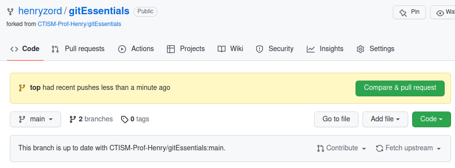
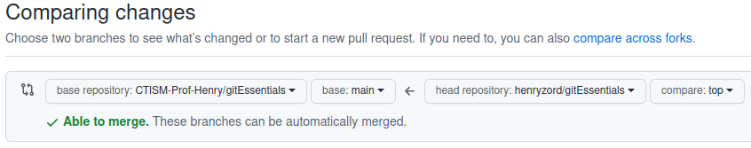
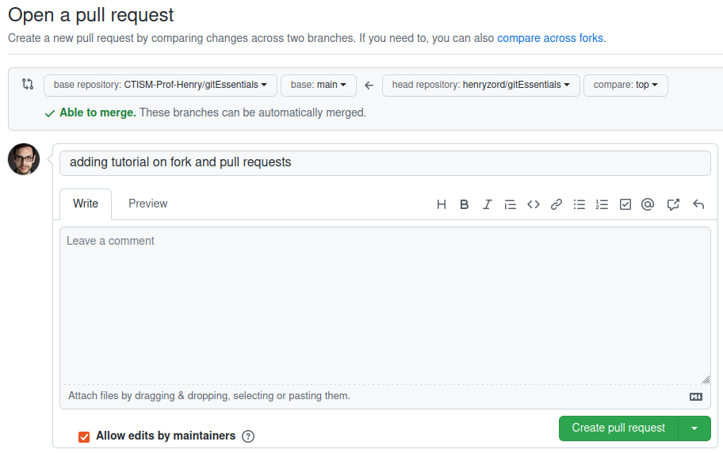
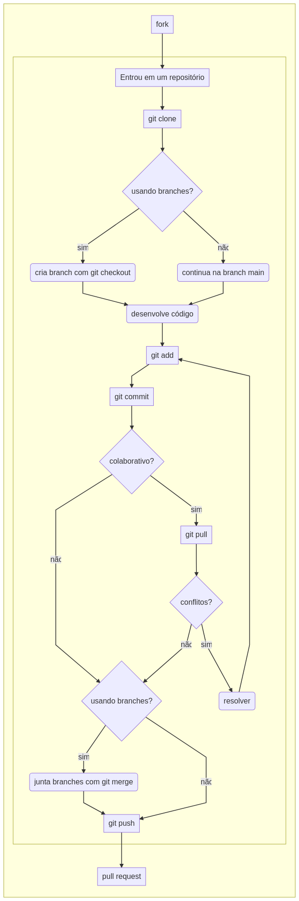

Fazendo fork e pull requests
============================

Uma das principais características do git é servir para o desenvolvimento de código-fonte **colaborativo**: quando
várias pessoas trabalham no mesmo código-fonte, ao mesmo tempo. O git fornece os meios necessários para coordenar o
trabalho, de forma que não se perca o foco do trabalho, tentando integrar diferentes versões do mesmo código-fonte.

Uma das modalidades de colaboração com o git é quando fazemos **fork** de um repositório. Um fork é um mecanismo de
colaboração em que copiamos o repositório remoto de outra pessoa (fork) para nossa conta do GitHub, fazemos modificações
na nossa cópia, e enviamos nossa cópia ao repositório remoto original (pull request), para que as modificações sejam
integradas neste. A aceitação das modificações realizadas dependem da aceitação dos mantenedores do repositório remoto
original.

Passo-a-passo
-------------

A seguir são descritos os passos necessários para fazer um fork e posteriormente um pull request em um repositório de
outro usuário do GitHub.

1. Acessar a página do repositório que deseja-se fazer o fork, no
   github. Vamos chamá-lo de
   ``https://github.com/CTISM-Prof-Henry/gitEssentials``;
2. Clicar no botão “fork”, no canto superior direito;
3. Confirmar que deseja-se fazer fork na tela que aparecer:

   |image0|

4. Clonar o repositório que foi recém criado (a cópia, não o original)
   com ``git clone``. Por exemplo, se eu, henryzord, fizer um fork do
   repositório **gitEssentials** (que pertence à conta
   CTISM-Prof-Henry), a URL do meu repositório copiado será
   ``https://github.com/henryzord/gitEssentials``, e o comando a ser executado é

   .. code:: bash

      git clone https://github.com/henryzord/gitEssentials

5. Criar uma nova **branch local**, e mudar para ela: ``git checkout -b <nome da branch>``. Supondo que queiramos criar
   uma nova branch de nome ``top``, o comando a ser executado é

   .. code:: bash

      git checkout -b top

6. Notificar o git de que este repositório relaciona-se com o
   repositório original:
   ``git remote add upstream <url do repo original>``. No exemplo,
   ficaria

   .. code:: bash

      git remote add upstream https://github.com/CTISM-Prof-Henry/gitEssentials

7.  Fazer as modificações necessárias no código-fonte (editar, deletar ou criar arquivos);
8.  Adicionar arquivos com

    .. code:: bash

       git add .

9.  Salvar modificações com

    .. code:: bash

       git commit -m "mensagem"

10. Executar um ``git pull`` para atualizar o repositório local com as modificações do repositório remoto original

    .. code:: bash

       git pull origin main

11. Enviar modificações para o repositório copiado, em uma **branch remota** que será criada, chamada ``top``:

    .. code:: bash

       git push -u origin top

12. Depois que enviarmos as modificações para o nosso repositório copiado, podemos acessá-lo pelo GitHub. Perceberemos
    uma mensagem na tela inicial, mostrando o quão atualizado nosso código-fonte deste repositório está em relação ao
    código-fonte do repositório original:

    |image1|

13. Enviaremos as modificações que fizemos no repositório copiado para o repositório original.
    **Atenção:** iremos fazer isto apenas quando tivermos terminado de fazer **todas** as modificações necessárias
    no nosso repositório copiado. No nosso repositório copiado, como mostrado na figura acima, vamos clicar no botão
    **Pull requests**;
14. Clicamos no botão **new pull request**;
15. Abrirá uma tela que irá comparar o nosso código-fonte copiado com o código-fonte original. Como a visualização
    padrão do GitHub é para a branch **main**, não irá mostrar nada significante, pois criamos uma
    nova branch **top**:

    |image2|

16. No seletor do repositório copiado, mudamos para a branch **top**:

    |image3|

17. Clicamos no botão **create new pull request**;
18. Neste passo poderemos escrever uma mensagem para o administrador do repositório original, explicando as
    modificações feitas no pull request. Depois de escrever a mensagem, clicamos em **create pull request**.

    |image4|

19. Esta tela é o que o **administrador do repositório original** verá, no GitHub dele:

    |image5|

Se ele aceitar nossas modificações, elas serão integradas ao repositório original. Poderemos vê-las na lista de commits
do repositório original.

Fluxograma
----------

O fluxograma de trabalho quando estamos trabalhando com forks e pull
requests é apresentado na figura abaixo:

|image6|

.. |image0| image:: ../imagens/fork_2.png

.. |image2| image:: ../imagens/fork_5.png

.. |image5| image:: ../imagens/fork_9.png
