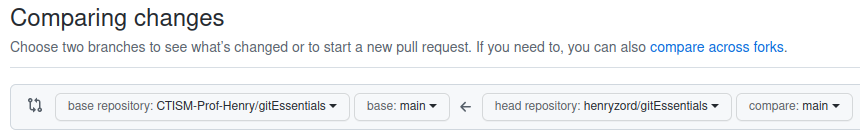
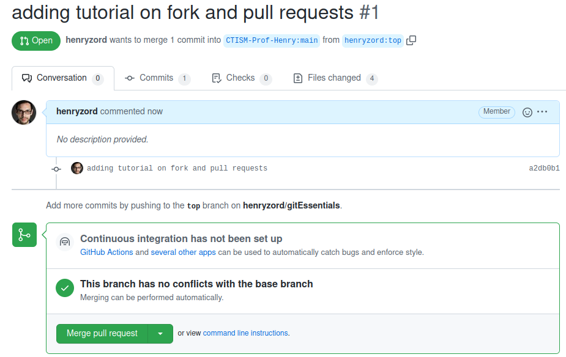

Fazendo fork e pull requests
============================

Uma das principais características do git é servir para o
desenvolvimento de código-fonte **colaborativo**; ou seja, quando várias
pessoas trabalham no mesmo código-fonte, ao mesmo tempo.

O git fornece os meios necessários para coordenar o trabalho, de forma
que o caos não se instale.

Uma das modalidades de colaboração com o git é quando fazemos **fork**
em um repositório. Um fork é um mecanismo de colaboração em que copiamos
o repositório de outra pessoa (fork), fazemos modificações nele, e
enviamos de volta à pessoa (pull request), para que ela avalie se quer
integrar nossas melhorias ao seu código ou não.

Um fork efetivamente cria uma cópia do repositório da outra pessoa na
nossa conta do Github. Dentro da nossa cópia do repositório, inclusive,
várias pessoas podem estar trabalhando juntas.

Fluxograma
----------

O fluxograma de trabalho quando estamos trabalhando com forks e pull
requests é o seguinte:

|image6|

Passo-a-passo
-------------

1. Entrar na página do repositório que deseja-se fazer o fork, no
   github. Vamos chamá-lo de
   ``https://github.com/CTISM-Prof-Henry/gitEssentials``
2. Clicar no botão “fork”, no canto superior direito:
3. Confirmar que deseja-se fazer fork na tela que aparecer:

|image0|

4. Clonar o repositório que foi recém criado (a cópia, não o original)
   com ``git clone``. Por exemplo, se eu, henryzord, fizer um fork do
   repositório **gitEssentials** (que pertence à conta
   CTISM-Prof-Henry), a URL do meu repositório copiado será
   ``https://github.com/henryzord/gitEssentials``, e o comando a ser
   dado é

.. code:: bash

   git clone https://github.com/henryzord/gitEssentials

5. Criar uma nova **branch local**, e mudar para ela:
   ``git checkout -b <nome da branch>``. Supondo que eu queira criar uma
   nova branch de nome **top**, o comando a ser dado é

.. code:: bash

   git checkout -b top

6. Notificar o git de que este repositório relaciona-se com o
   repositório original:
   ``git remote add upstream <url do repo original>``. No exemplo,
   ficaria

.. code:: bash

   git remote add upstream https://github.com/CTISM-Prof-Henry/gitEssentials

7.  Fazer as modificações necessárias no código-fonte (editar, deletar
    ou criar arquivos)
8.  Adicionar arquivos com ``git add``: ``git add .``, por exemplo
9.  Salvar modificações com ``git commit -m "mensagem"``
10. Dar um ``git pull`` para atualizar o repositório local com as
    modificações do repositório remoto original
11. Enviar modificações para o repositório copiado, em uma **branch
    remota** que será criada, chamada **top**:
    ``git push -u origin top``
12. Depois que você enviar as modificações para o seu repositório
    copiado, você pode acessá-lo pelo Github. Você perceberá uma
    mensagem na tela inicial, mostrando o quão atualizado seu código
    deste repositório está em relação ao código do repositório original:

|image1|

13. Nós iremos enviar as modificações que fizemos no repositório copiado
    para o repositório original. **Atenção:** faça isso apenas quando
    você tiver terminado de fazer **todas** as modificações necessárias
    no seu repositório copiado.

    No seu repositório copiado, como mostrado na figura acima, clique no
    botão **Pull requests**

14. Clique no botão **new pull request**:

15. Abrirá uma tela que irá comparar o seu código-fonte copiado com o
    código-fonte original. Como a visualização padrão do Github é para a
    branch **main**, não irá mostrar nada significante, pois criamos uma
    nova branch **top**:

|image2|

16. No seletor do repositório copiado, mude para a branch **top**:

|image3|

17. Clique no botão **create new pull request**:
18. Neste passo você pode escrever uma mensagem para o administrador do
    repositório original, explicando as modificações que foram feitas no
    pull request. Depois de escrever sua mensagem para ele, clique em
    **create pull request**.

|image4|

19. Esta tela é o que o **administrador do repositório original** verá,
    no Github dele:

|image5|

Se ele aceitar suas modificações, elas serão integradas ao repositório
original. Você poderá vê-las na lista de commits do repositório
original.

.. |image0| image:: ../imagens/fork_2.png
.. |image1| image:: ../imagens/fork_3.png

.. |image3| image:: ../imagens/fork_6.png
.. |image4| image:: ../imagens/fork_8.png

.. |image6| image:: ../imagens/fork_pull_request_diagrama.png