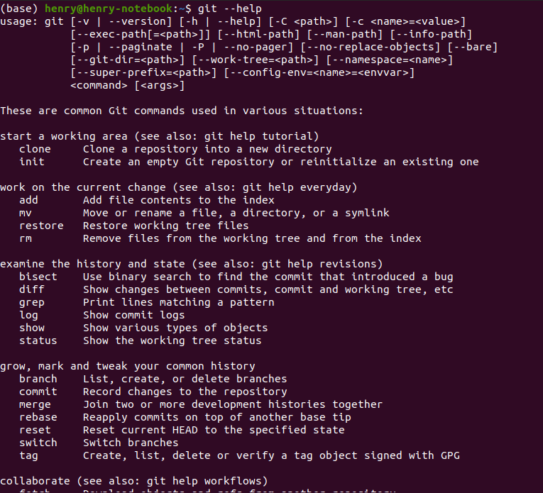
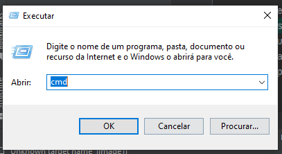

.. _instalacao:

Instalação
==========

Este material cobre a instalação em dois sistemas operacionais, em duas versões específicas:
Windows 10 e Linux Ubuntu 20.04 LTS. É provável que as instruções aqui funcionem para outras
versões do Windows (e.g. 7, 11), e que as instruções também funcionem para outras distribuições
do Linux (e.g. Arch, Debian, etc).

Instruções para o Windows
-------------------------

1. Baixe o git `neste link <https://git-scm.com/downloads>`__;
    * Cuide para baixar a versão adequada (32 ou 64 bits). Provavelmente, seu sistema operacional
      é 64 bits; se algum problema acontecer na instalação, baixe a versão 32 bits.
2. Siga o passo-a-passo do instalador (apenas clique **Next**, nenhuma opção precisa se modificada);
3. Verifique se o programa foi instalado corretamente. Aperte as teclas **Logotipo do Windows** + **R** ao mesmo tempo,
   escreva `cmd` na janela que aparecer, e então **OK**:

   .. only:: latex

      |image1_latex|

   .. only:: html

      |image1_html|

4. Se o programa não funcionar, será necessário adicionar o programa ao PATH do sistema manualmente:
    1. Clique no Menu Iniciar;
    2. Digite "Meu Computador" na barra de busca;
    3. No ícone que aparecer, selecione a opção **Propriedades**;
    4. Na lista de opções da direita, selecione a opção **Configurações Avançadas do Sistema**;
    5. Clique no botão **Variáveis do ambiente**;
    6. Na seção *Variáveis do ambiente para o usuário `<nome do usuário>`*, onde `<nome do usuário>` é o nome do usuário
       do Windows, encontre a variável de nome `PATH`;
    7. Clique duas vezes sobre ela;
    8. Selecione o botão **Novo**;
    9. Escreva o caminho onde o programa `git` se encontra no seu computador, **mais** a pasta `bin`;
        * Por padrão, o instalador coloca o git na pasta `C:\Program Files\Git`, portanto você deve digitar o endereço
          `C:\Program Files\Git\bin` na caixa de texto.
    10. Dê **Ok** em todas as janelas abertas.

5. Feche o prompt de comando e repita o passo 3 novamente.

Instruções para o Linux
-----------------------

1. Abra o Terminal;
2. Digite `sudo apt-get install git`;
3. Insira sua senha;
4. Feche e abra novamente o Terminal, **OU** digite `source ~/.bashrc`;
5. Teste o programa digitando `git --help`. Se uma janela como a abaixo aparecer, estará tudo certo:

.. only:: latex

  |image0_latex|

.. only:: html

  |image0_html|

