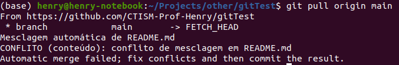

.. _resolvendo-conflitos-tela-1:

Definindo o método de conciliação de conflitos
==============================================

Na imagem abaixo, o git não sabe como os conflitos devem ser conciliados, e está nos perguntando o que ele deve fazer
(texto escrito em amarelo):

.. only:: latex

   |image0_latex|

.. only:: html

   |image0_html|

Neste material, usaremos a opção **merge**, rodando o seguinte comando:

.. code:: bash

   git config pull.rebase false

Execute novamente o comando ``git pull origin main``:

.. only:: latex

   |image1_latex|

   Siga para a :numref:`resolvendo-conflitos-tela-2` para finalizar a resolução de conflitos.

.. only:: html

   |image1_html|

   Siga para a Seção :ref:`resolvendo-conflitos-tela-2` para finalizar a resolução de conflitos.

.. |image0_latex| image:: ../../imagens/conflito_2.png
   :scale: 50%
.. |image0_html| image:: ../../imagens/conflito_2.png
   :scale: 100%

