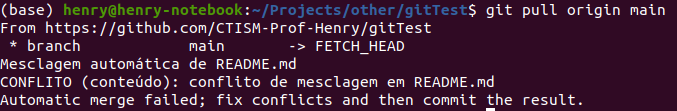
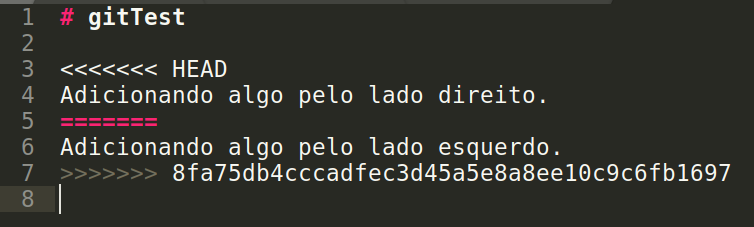
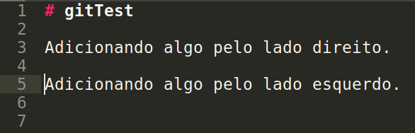
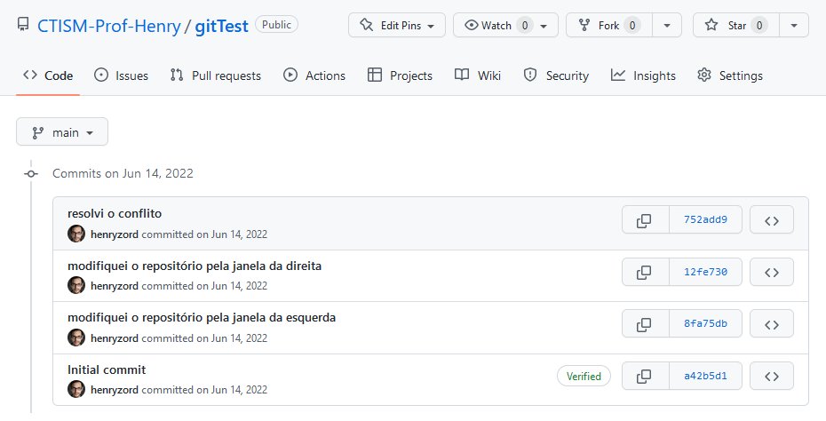

.. _resolvendo-conflitos-tela-2:

Finalizando
===========

A mensagem *Automatic merge failed; fix conflicts and then commit the result* quer dizer que teremos que abrir os
arquivos que resultaram em conflitos e deixá-los da maneira que eles devem ficar corretamente:

.. only:: latex

   |image0_latex|

.. only:: html

   |image0_html|

Saberemos quais arquivos possuem conflitos pela mensagem do git: na imagem acima, o conflito está no arquivo ``README.md``.

Abrindo o arquivo README.md por um editor de textos (a sugestão dos autores é pelo Sublime Text [#]_), vemos que ele
se apresenta da seguinte forma:

.. only:: latex

   |image1_latex|

.. only:: html

   |image1_html|

-  Os caracteres ``<<<<`` marcam o começo da região que resultou em um conflito;
-  Os caracteres ``>>>>`` marcam o fim da região conflitante;
-  Os caracteres ``====`` marcam a divisão do código;
-  A seção que começa com ``HEAD`` delimita o código-fonte como apresentado no repositório local (do nosso computador);
-  A seção marcada pela hash (que varia de acordo com o commit; neste exemplo é a hash
   ``8fa75db4cccadfec3d45a5e8a8ee10c9c6fb1697``) é o código-fonte encontrado no repositório remoto. Na verdade, este hash
   é o identificador único do commit no repositório remoto.

Vamos arrumar o arquivo de maneira que ele concilie as duas modificações, tanto do repositório remoto quanto do
repositório local:

.. only:: latex

   |image2_latex|

.. only:: html

   |image2_html|

Após a correção, voltamos à linha de comando para enviar as modificações ao repositório remoto:

|image3|

Pronto! Com isso, a resolução de conflito que acabamos de fazer estará presente no repositório remoto:

.. only:: latex

   |image4_latex|

.. only:: html

   |image4_html|

.. |image3| image:: ../../imagens/conflito_6.png

.. [#] Disponível em `<https://www.sublimetext.com/>`__. Acesso em 01/12/2022.
